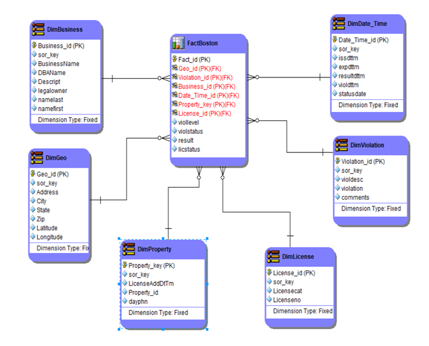

# Boston Food Inspections (Dimensional Model, Data Integration Workflow)
## Deliverables:
* Identify Dimensions & Facts
* Create a Dimensional Data Model (ER/Studio)
* Create DDL for any database being used in this class
* Create schema in chosen database
* Create data preparation workflow to load data (Alteryx)
* Load data

## Dimensional Data Model:

## Data Preparation Workflow:

## Table Row Counts:

