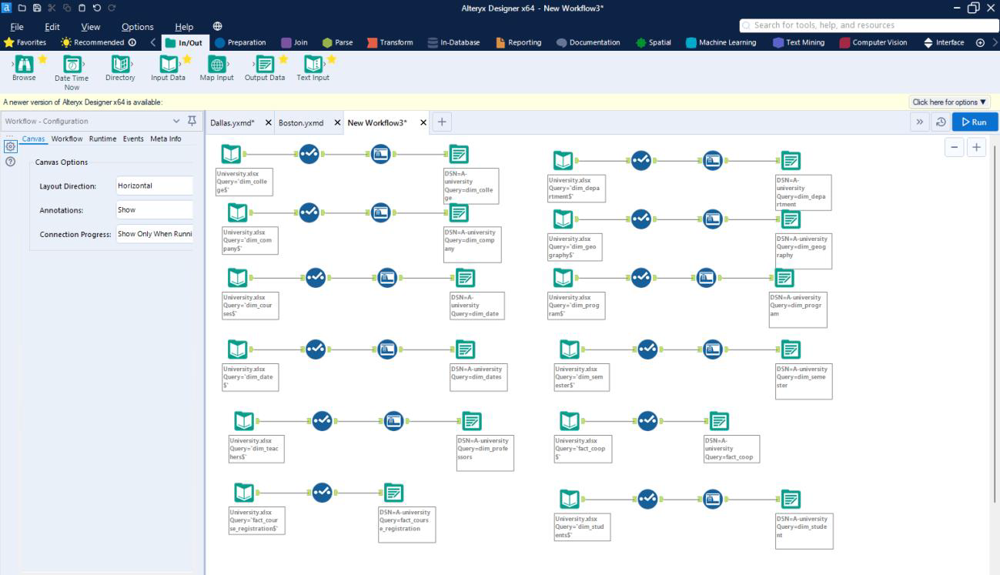

# University Degree Program (Dimensional Model, Data Integration Workflow)
## Deliverables:
* Create a list of dimensions & facts
* Create tables with a sample list of attributes for the above
* Create a Dimensional Data Model (ER/Studio)
* Create DDL for any database being used in this class
* Create schema in chosen database
* Create sample data & store in Excel, csv or tsv files
* Create data preparation workflow to load data (Alteryx)
* Load the sample data using Alteryx data prep
* Create SQL queries answering some of the questions used for requirements
* Use PowerBI to display some of the data 

## Dimensional Data Model:

## Data Preparation Workflow:

## PowerBI Report:

